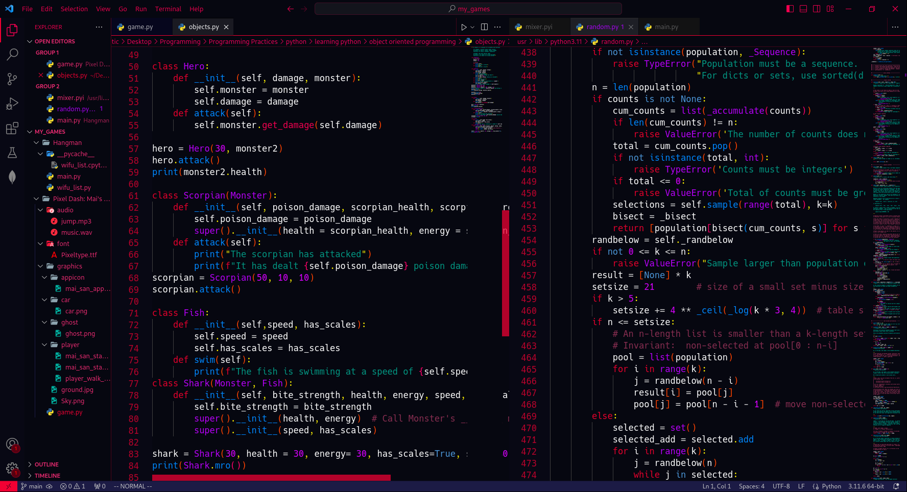
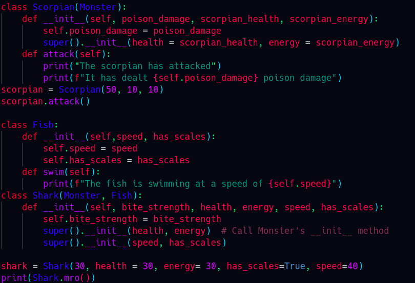

# Apathetic Rose Radiance VS Code Theme



## Description

The Apathetic Rose Radiance VS Code theme is a visually stunning combination of rose, purple, blue, and green, with a predominant focus on the subtle and sophisticated rose accent. Enjoy a coding experience with awesome syntax highlighting that enhances readability.

## Installation

1. Open Visual Studio Code.
2. Open user settings (press `Ctrl+Shift+P` and type `Open Settings`).
3. (apathetic-rose-radiance.json) Copy the code from:
   ```json
   //paste all of the code
   "
   "workbench.colorCustomizations": {
   activityBar.background": "#080a14",...
   }
   ```
   to the end line of the file
4. Paste the copied code into the `settings.json` file
5. Done!

## Theme Preview



## Customization

Feel free to customize the theme according to your preferences. If you have suggestions or issues, please open an [issue](https://github.com/ApatheticDamn/apathetic-vs-code-theme/issues).
